# HOMEWORK_SDB_DDL_DML
# Задание 1
# Ответ
## Поднятие чистого инстанса MySQL 8.0+
```
docker run --name mysql8 -e MYSQL_ROOT_PASSWORD=123 -e MYSQL_USER=art -e MYSQL_PASSWORD=123 -p 3306:3306 -d mysql:8.0

```
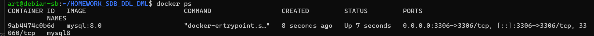


-- дальше можно работать в консоли:

```
docker exec -it mysql8 mysql -u root -p
```
или 
```
docker exec -it mysql8 mysql -u root -p -e "SELECT user, host FROM mysql.user;"
```
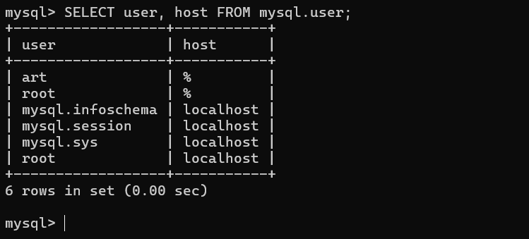


-- а можно в бобре: 

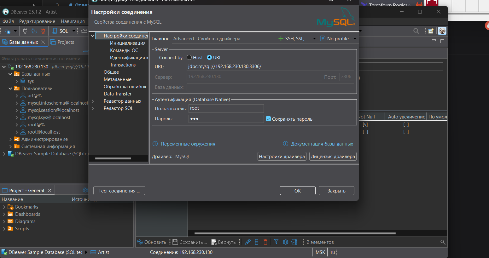

Если плолучили ошибку при подключении 
```
debiver Public Key Retrieval is not allowed 
```
выбираем URL набираем: 
```
jdbc:mysql://192.168.230.130:3306/?allowPublicKeyRetrieval=true&useSSL=false
```
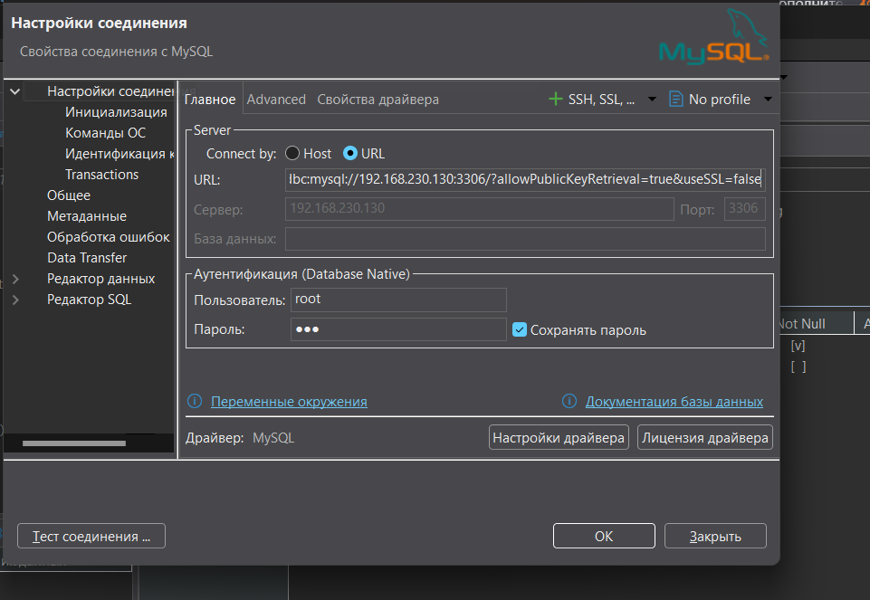

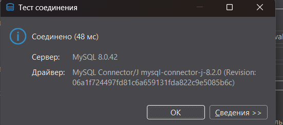


## -- 1.2. Создание учётной записи sys_temp
```
CREATE USER 'sys_temp'@'%' IDENTIFIED BY 'password';
```
``%`` - разрешает подключаться с любого хоста
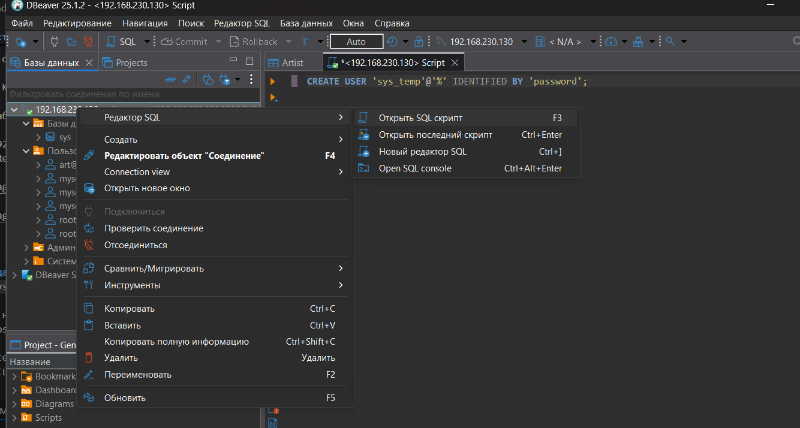


-- 1.3. Запрос на получение списка пользователей
```
SELECT user, host FROM mysql.user;
```
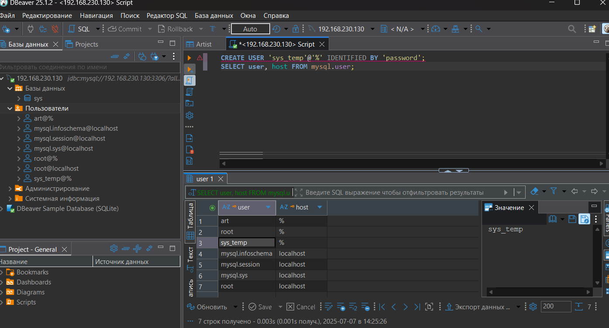


-- 1.4. Дать все права для пользователя sys_temp
```
GRANT ALL PRIVILEGES ON *.* TO 'sys_temp'@'%';
```
Первая звездочка (*) - все базы данных на сервере
Вторая звездочка (*) - все таблицы в этих базах данных
Таким образом, *.* означает "все таблицы во всех базах данных".

-- 1.5. Запрос на получение списка прав для sys_temp
SHOW GRANTS FOR 'sys_temp'@'%';
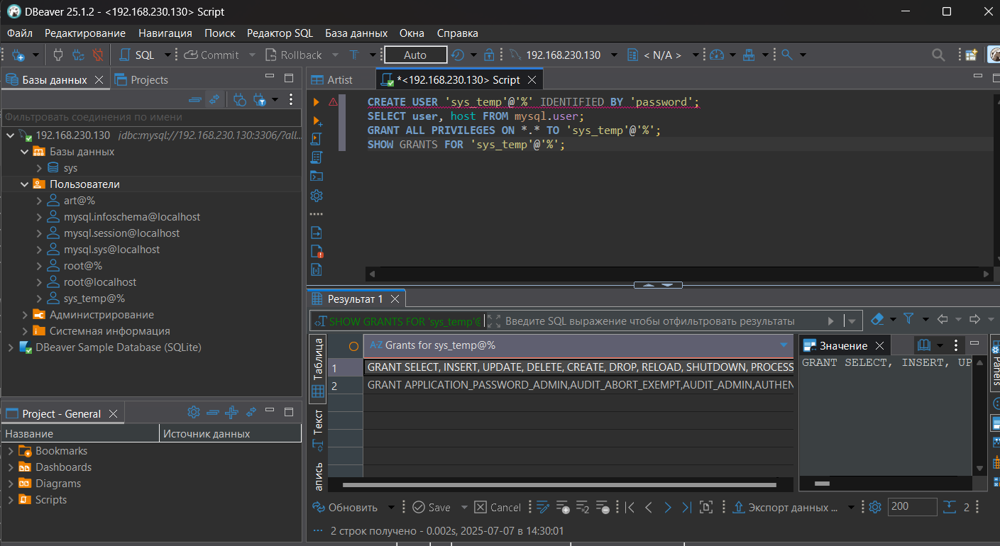

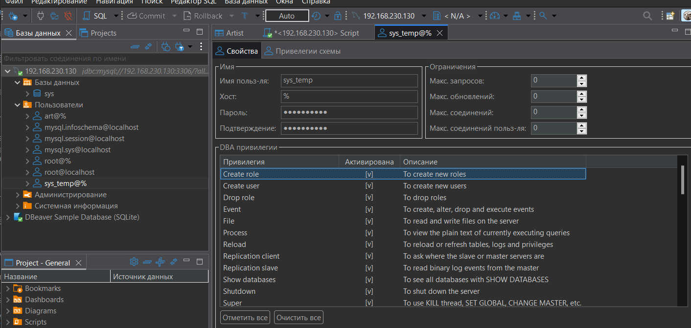


-- 1.6. Переподключение от имени sys_temp (выполняется в клиенте)
-- Затем смена типа аутентификации
```
ALTER USER 'sys_temp'@'%' IDENTIFIED WITH mysql_native_password BY 'password';
```


-- 1.7. Восстановление дампа sakila (выполняется в командной строке)
в бобре:
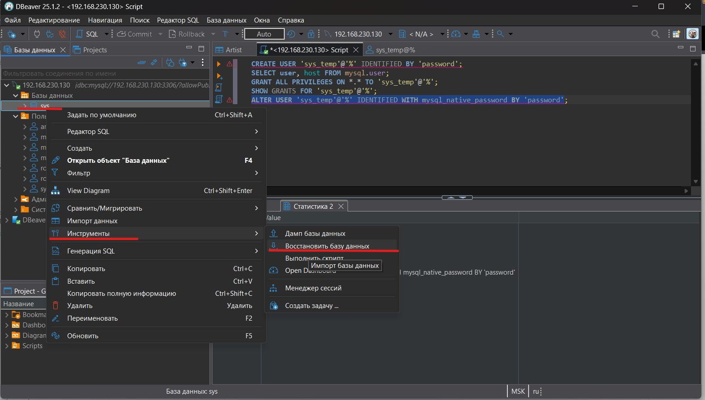
если локально :
```
-- mysql -u sys_temp -p sakila < sakila-schema.sql
-- mysql -u sys_temp -p sakila < sakila-data.sql
```
в случае с docker
```
docker exec -i mysql8 mysql -u root -p123 < sakila-schema.sql
```
```
cat sakila-schema.sql | docker exec -i mysql8 mysql -u root -p123
```


-- 1.8. Получение списка таблиц базы sakila
```
USE sakila;
SHOW TABLES;
```
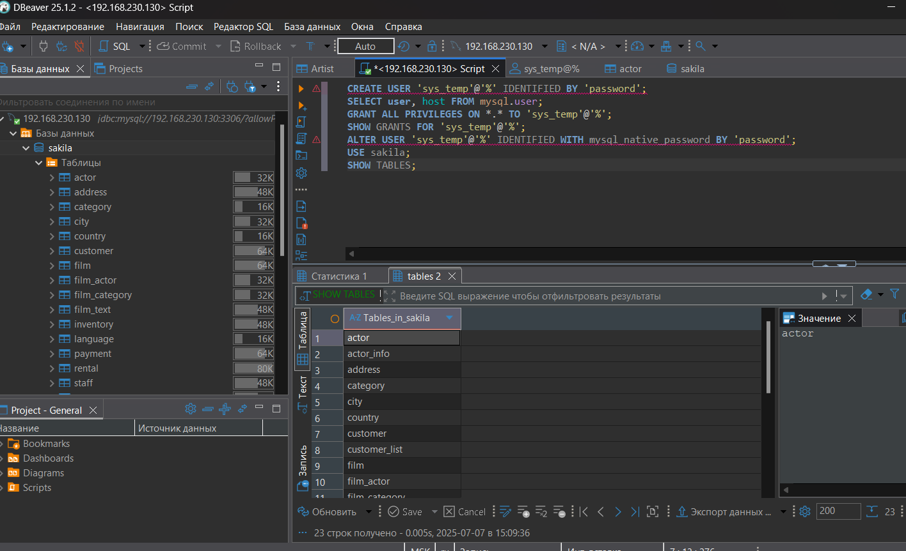

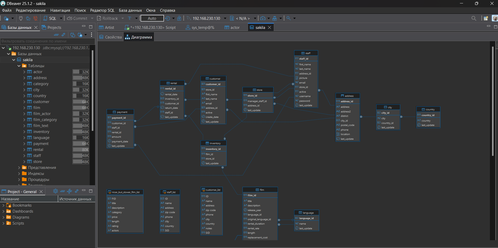


# Задание 2
Составьте таблицу, используя любой текстовый редактор или Excel, в которой должно быть два столбца: в первом должны быть названия таблиц восстановленной базы, во втором названия первичных ключей этих таблиц. Пример: (скриншот/текст)
```
Название таблицы | Название первичного ключа
customer         | customer_id

```
нашел такой запрос: 
```
SELECT TABLE_NAME, COLUMN_NAME 
FROM INFORMATION_SCHEMA.KEY_COLUMN_USAGE 
WHERE TABLE_SCHEMA = 'sakila' AND CONSTRAINT_NAME = 'PRIMARY';
```
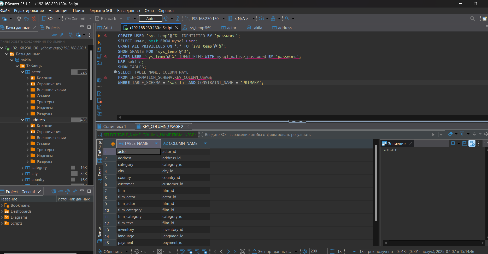
```
Название таблицы       | Название первичного ключа
actor                  | actor_id
actor_info             | (нет первичного ключа)
address                | address_id
category               | category_id
city                   | city_id
country                | country_id
customer               | customer_id
customer_list          | (нет первичного ключа)
film                   | film_id
film_actor             | (actor_id, film_id)
film_category          | (film_id, category_id)
film_list              | (нет первичного ключа)
film_text              | film_id
inventory              | inventory_id
language               | language_id
nicer_but_slower_film_list | (нет первичного ключа)
payment                | payment_id
rental                 | rental_id
sales_by_film_category | (нет первичного ключа)
sales_by_store         | (нет первичного ключа)
staff                  | staff_id
staff_list             | (нет первичного ключа)
store                  | store_id
```

# 3. Убираем права на внесение, изменение и удаление данных из sakila
```
# Сначала отзываем глобальные права (которые даны через ON *.*)

REVOKE ALL PRIVILEGES ON *.* FROM 'sys_temp'@'%';
```
```
Затем даем только нужные права на базу sakila
GRANT SELECT ON sakila.* TO 'sys_temp'@'%';
```
```
 Проверяем результат
SHOW GRANTS FOR 'sys_temp'@'%';
```
```
GRANT USAGE GRANT SELECT ON `sakila`.* TO `sys_temp`@`%`ON *.* TO `sys_temp`@`%`

```

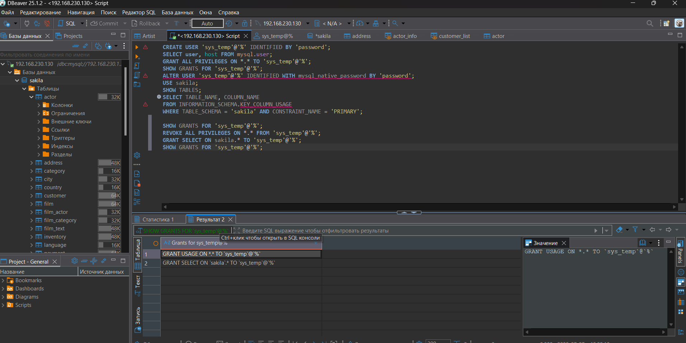
-- 3.2. Запрос на получение списка прав для sys_temp
```
SHOW GRANTS FOR 'sys_temp'@'%';
```
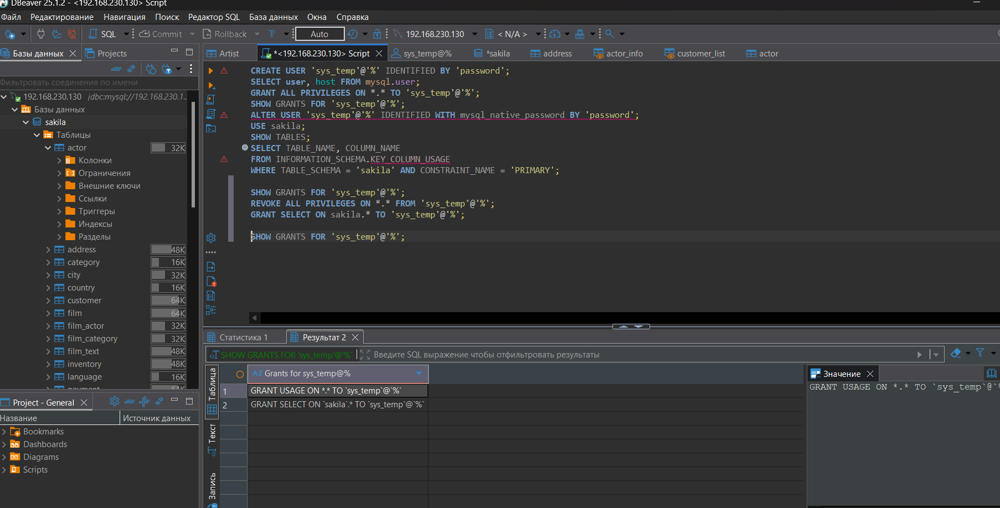